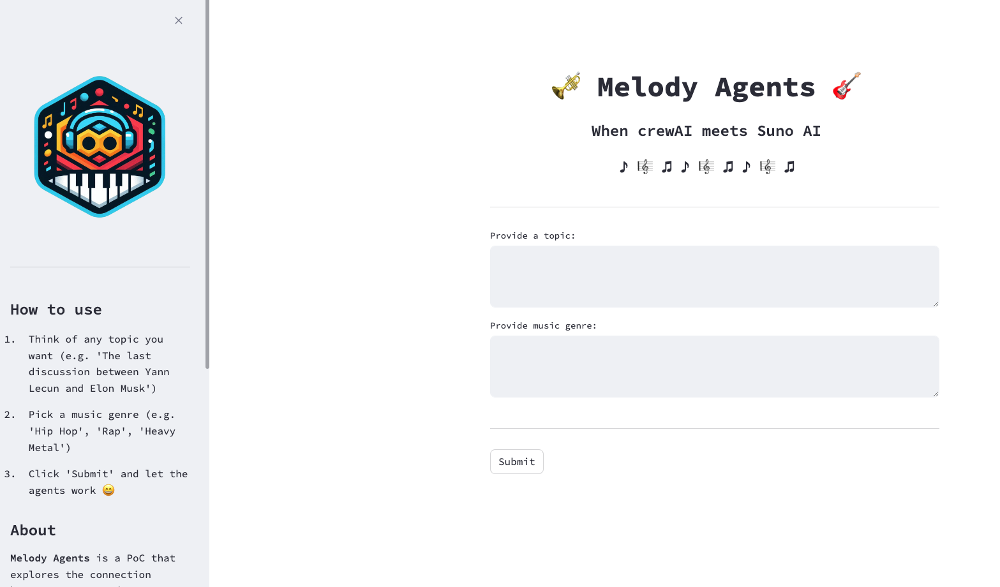

<p align="center">
    
    <h1 align="center">Melody Agents</h1>
    <h3 align="center">When crewAI meets Suno AI</h3>
</p>

## Introduction

Ever thought of how a Heavy Metal song about the last tweet of Elon Musk would sound? Well, this is your repo then ...


## Description

This repository contains a crewAI application for automatically generating songs given a **topic** and a **musc genre**. The song generation is done using [the "unofficial" Suno AI API](https://github.com/gcui-art/suno-api).

The crew consists of [three agents](agents.py):

1️⃣ Web Researcher Agent

The Web Researcher Agent searches for relevant information in the web about a provided `topic`. 


2️⃣ Lyrics Creator Agent

The Lyrics Creator Agent takes the previous research and generates high quality lyrics from it. In addition,
it adapts the lyrics to the provided `music genre`.

3️⃣ Song Generator Agent

The Son Generator Agent takes the generated lyrics and uses the [Suno custom tool](custom_tools/suno_ai_tool.py) to
interact with the Suno API and download two candidate songs.

## Getting Started

Thr first thing you'll need to do is to create a `.env` and provide values for the following variables:

`SUNO_COOKIE`: You'll need this to use the Suno API, please [check the instructions in the unofficial Suno API repo](https://github.com/gcui-art/suno-api).
`GROQ_API_KEY`: Your [Groq](https://groq.com/) API Key. Why Groq? Because it's free!
`SERPER_API_KEY`: Your [Serper](https://serper.dev/) API KEY.

> Check the `.env.example` if you have doubts about the `.env` structure

Now that you have all the env variables configured, it is time to let the Docker magic begin! This project is configured
using [docker-compose](https://docs.docker.com/compose/), where you'll be creating two containers; one container for
the Suno API logic and the other for the streamlit + crewAI logic. You can check the docker-compose specification
[here](docker-compose.yml).

To start the application, simply run:

```sh
docker compose build & docker compose up
```

A Streamlit application will be launched on your localhost, on port `8501`. 


If you click the URL, you should see something like this:

